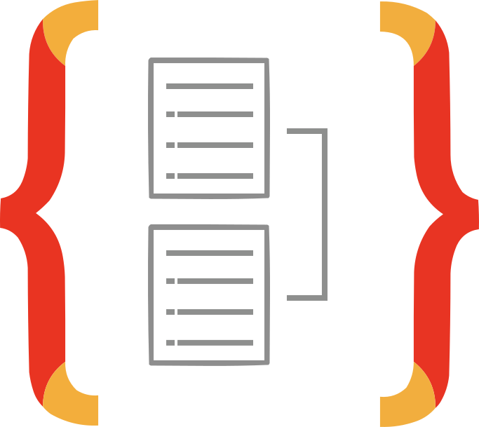
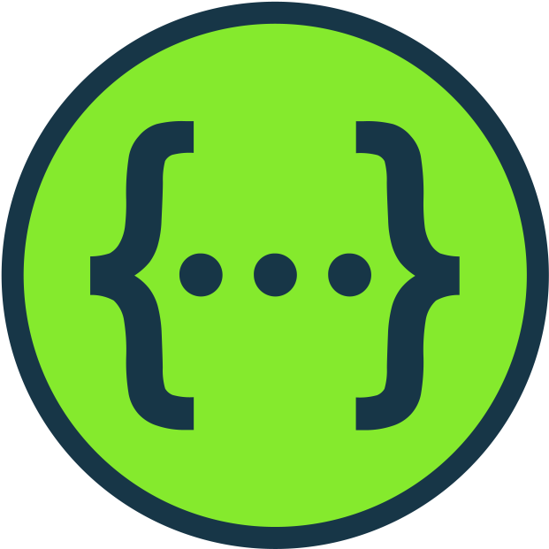

<p align="center">
  <a href="https://www.typescriptlang.org/" target="blank"></a>
  <a href="https://nestjs.com/" target="blank"></a>
  <a href="https://typeorm.io/" target="blank"></a>
  <a href="https://swagger.io/" target="blank"></a>
</p>

<h1 align="Center">HiveMind Backend</h1>

This repository contains the source code for the HiveMind REST API, developed as part of a student project for the Web Technologies course in the Computer Science degree program at the University of Naples Federico II.

It is designed with the objectives of respecting REST principles as much as possible, enforcing validation in an elegant way, and documenting in detail following the OpenApi specification.

## Build instructions

To run the project, hosting it on `http://localhost/`, first you will need to rename the file `.env.example` to `.env`, then run one of the following commands:

```bash
# development
$ npm run start

# watch mode
$ npm run start:dev

# production mode
$ npm run start:prod
```

After running it, swagger documentation for the project can be viewed at `http://localhost/api-docs`

## Technologies

- The **[TypeScript](https://www.typescriptlang.org/)** programming language and the **[NestJS](https://nestjs.com/)** framework, built on top of **[Express](https://expressjs.com)** for **[NodeJS](https://nodejs.org/en)** were used for the development of the application.

- **[TypeORM](https://typeorm.io/)** is the ORM used to store, query, manipulate data in a database.

- The **[Swagger](https://swagger.io/)** was used to provide documentation for the REST API.

- The packages **[class-validator](https://github.com/typestack/class-validator)** and **[class-transformer](https://github.com/typestack/class-transformer)** were used to define constraints and enforcing validation in an elegant, readable and extendable way, with the use of decorators.

- Other important packages used for the project include **[passport-jwt](https://www.passportjs.org/packages/passport-jwt/)**, **[bcrypt](https://www.npmjs.com/package/bcrypt)**, **[sanitize-html](https://www.npmjs.com/package/sanitize-html)**, **[lodash](https://lodash.com/)**
